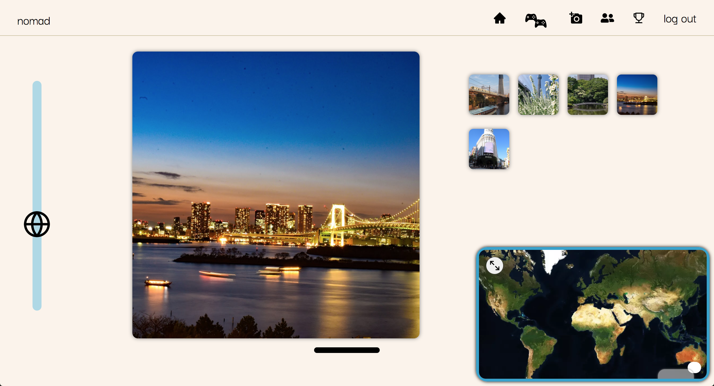

# nomad

<p align="center">
  
</p>

nomad (sic) is a responsive web-based game allowing users to explore the world through guessing the exact location of crowdsourced photos. Users are able to upload images, from which coordinates are parsed, and these images become part of a game that users can play globally. It's clean design includes a 3D globe on which color-coded arcs represent the difference between the user's guess and the correct location. nomad (sic) supports multiplayer mode, and creating a network of friends on the app.

## Screenshots

<p align="center">
  
  
</p>

## Getting started

Except for the regular suspects; git, Node, npm, you need these things to work on nomad.

**Recommended!**

- [nomad backend](https://github.com/kipvla/geo-backend)

## Installation

1. Clone this repo and enter!

   ```bash
   git clone https://github.com/kipvla/geo-frontend.git
   cd geo-frontend
   ```

2. Install dependencies.

   ```bash
   npm install
   ```

3. Run `npm start` to start the development environment locally.

4. The app will run on localhost:8000, as per usual with Gatsby apps.

<!-- TODO -->

5. Database...

## Tech Stack

- [Gatsby](https://www.gatsbyjs.com/)
- [React](https://reactjs.org/)
- [mapbox](https://www.mapbox.com/)

## Developers

- Charley Carriero - [GitHub](https://github.com/charcarr) - [LinkedIn](https://www.linkedin.com/in/charleycarriero/)
- Ujwal Kandukuri - [GitHub](https://github.com/ujwalka) - [LinkedIn](https://www.linkedin.com/in/ujwalkan/)
- Kip Riecken - [GitHub](https://github.com/kipvla) - [LinkedIn](https://www.linkedin.com/in/kipriecken/)
- Santiago Vásquez Yacamán - [GitHub](https://github.com/sancar22) - [LinkedIn](https://www.linkedin.com/in/santiagovasquezyaca/)
